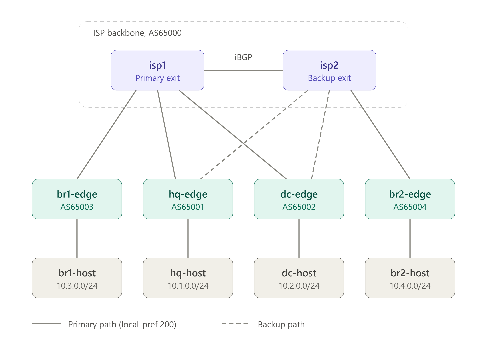

# NetOps Agent Demo

This is a simple demo of a Network Operation Agent supporting a network topology. By using a chat prompt, you ask the agent to check the health of the network and perform troubleshooting if there is any issue. Treat it like an network engineer.

## Concept

Any agent, inclulding this one, is a loop: User prompt → model thinks → asks help via tools → feed result back → repeat until it answers → response back to User. 
Guardrail (safety, memory, UI) is layered on that loop.

```
User (chat) ─▶ agent loop ─▶ Model API ◀─ system prompt + intent.yml
                 │  ▲
        tool call│  │result
                 ▼  │
           tools/lab_cli.py ─▶ docker exec ─▶ vtysh on FRR nodes (containered network devices)
```

## Network Topology

A simple network topology consisting of four sites (HQ, DC, Branch 1, Branch 2), each with an FRR edge router and a test host, connect via eBGP to two ISP routers (AS65000, iBGP between them). HQ and DC are dual-homed to both ISPs, preferring ISP1. Branch 1 uses ISP1 only, Branch 2 uses ISP2 only. No site provides transit.

<div style="flex: 1;">
  
</div>
  
Routing setup: each edge runs eBGP to the ISP (AS65000). ISPs peer iBGP with next-hop-self.
Dual-homed sites prefer isp1 (local-pref 200) and only advertise their own LAN
(no transit). Hosts sit at 10.X.0.10.

## How the Demo works ?

- The network topology was built on container lab. All simulated device (FRR node) are running healthy
- Devices are asseessbile via cli (docker exec) both manually or by the agent
- The agent prompt runs in parallel and ready for you to query the status of the network topology
- We then inject a changes to break the network, causing some kind of issues.
- As the agent prompt to perform troubleshooting of the issues, and find out the root case, suggest the fix
- Only the following commands are allowed as tool

| Tool | Command it runs | What it's allowed to do |
|---|---|---|
| `show` | `vtysh -c "<command>"` on a router | Any command starting with `show `, no shell metacharacters (`;`, `\|`, `&`, `` ` ``, `$`). Covers `show bgp summary`, `show ip route <prefix>`, `show running-config`, `show bgp neighbor <ip>`, `show interface <iface>`, and any other FRR `show ...` subcommand. |
| `ping` | `ping -c <count> -W 1 <target>` from a host | `target` must be a plain IPv4 address (digits and dots only) |
| `traceroute` | `traceroute -n -w 1 <target>` from a host | Same IPv4-only restriction as `ping` |
| `linkstats` | `ip -s link show <iface>` + `tc qdisc show dev <iface>` on a router | `iface` must match `eth<N>`. Reveals kernel-level faults (delay/loss injected via `tc`/netem) that are invisible to any FRR `show` command |

- The following faults can be injested.

| Fault | What breaks | Symptom |
|---|---|---|
| `uplink-down` | HQ's link to ISP1 goes down | HQ fails over to ISP2 as its exit |
| `wrong-asn` | Branch 1's neighbor `remote-as` is changed to 65099 (should be 65000) | BGP session to ISP1 stuck `Idle`; Branch 1 isolated from every other site |
| `missing-network` | Branch 2's LAN prefix is withdrawn from BGP | BGP session stays `Established`, but Branch 2's LAN is unreachable from everywhere |
| `latency` | 200 ms delay and 20% loss added to DC's ISP1 link | DC traffic is slow and lossy, but BGP sessions look fine |

# How to Run it

## Step 1: Install docker & containerlab in your shell environment
Once it is done, confirm this is in place.
```bash
docker run hello-world          # Docker works in WSL2
containerlab version            # Containerlab works
```

## Step 2: Build the network topology
Download the [wan-lab.zip](./wan-lab.zip) Unzip it in your home folder:

```bash
   cd ~
   unzip wan-lab.zip            # sudo apt install -y unzip, if needed
   cd wan-lab
   ```
Deploy the network topology:
```bash
   sudo containerlab deploy -t wanlab.clab.yml
   ```
<details>
  <summary> Sample Output</summary>

```
22:02:06 INFO Parsing & checking topology file=wanlab.clab.yml
22:02:06 INFO Parsing & checking topology file=wanlab.clab.yml
22:02:06 INFO Destroying lab name=wanlab
22:02:07 INFO Removed container name=clab-wanlab-br2-host
22:02:07 INFO Removed container name=clab-wanlab-br1-host
22:02:07 INFO Removed container name=clab-wanlab-br2-edge
22:02:07 INFO Removed container name=clab-wanlab-br1-edge
22:02:07 INFO Removed container name=clab-wanlab-hq-host
22:02:07 INFO Removed container name=clab-wanlab-hq-edge
22:02:07 INFO Removed container name=clab-wanlab-isp2
22:02:07 INFO Removed container name=clab-wanlab-isp1
22:02:07 INFO Removed container name=clab-wanlab-dc-host
22:02:07 INFO Removed container name=clab-wanlab-dc-edge
22:02:07 INFO Removing host entries path=/etc/hosts
22:02:07 INFO Removing SSH config path=/etc/ssh/ssh_config.d/clab-wanlab.conf
(.venv) elo@DESKTOP-9CL16MS:~/wan-lab$
(.venv) elo@DESKTOP-9CL16MS:~/wan-lab$ sudo containerlab deploy -t wanlab.clab.yml
22:03:35 INFO Containerlab started version=0.79.0
22:03:35 INFO Parsing & checking topology file=wanlab.clab.yml
22:03:35 INFO Creating docker network name=wanlab-mgmt IPv4 subnet=172.20.30.0/24 IPv6 subnet="" MTU=0
22:03:35 INFO Creating lab directory path=/home/elo/wan-lab/clab-wanlab
22:03:35 INFO Creating container name=isp1
22:03:35 INFO Creating container name=hq-host
22:03:35 INFO Creating container name=dc-edge
22:03:35 INFO Creating container name=dc-host
22:03:35 INFO Creating container name=br2-edge
22:03:35 INFO Creating container name=hq-edge
22:03:36 INFO Created link: dc-edge:eth3 ▪┄┄▪ dc-host:eth1
22:03:36 INFO Created link: hq-edge:eth1 ▪┄┄▪ isp1:eth2
22:03:36 INFO Creating container name=br1-host
22:03:36 INFO Created link: hq-edge:eth3 ▪┄┄▪ hq-host:eth1
22:03:36 INFO Created link: dc-edge:eth1 ▪┄┄▪ isp1:eth3
22:03:36 INFO Creating container name=br2-host
22:03:36 INFO Creating container name=isp2
22:03:37 INFO Creating container name=br1-edge
22:03:37 INFO Created link: isp1:eth1 ▪┄┄▪ isp2:eth1
22:03:37 INFO Created link: hq-edge:eth2 ▪┄┄▪ isp2:eth2
22:03:37 INFO Created link: br1-edge:eth1 ▪┄┄▪ isp1:eth4
22:03:37 INFO Created link: dc-edge:eth2 ▪┄┄▪ isp2:eth3
22:03:37 INFO Created link: br1-edge:eth2 ▪┄┄▪ br1-host:eth1
22:03:37 INFO Created link: br2-edge:eth2 ▪┄┄▪ br2-host:eth1
22:03:37 INFO Created link: br2-edge:eth1 ▪┄┄▪ isp2:eth4
22:03:37 INFO Executed command node=dc-host command="ip addr add 10.2.0.10/24 dev eth1" stdout=""
22:03:37 INFO Executed command node=hq-host command="ip addr add 10.1.0.10/24 dev eth1" stdout=""
22:03:37 INFO Executed command node=dc-host command="ip route replace default via 10.2.0.1" stdout=""
22:03:37 INFO Executed command node=br2-edge command="ip addr add 172.16.6.2/30 dev eth1" stdout=""
22:03:37 INFO Executed command node=hq-host command="ip route replace default via 10.1.0.1" stdout=""
22:03:37 INFO Executed command node=dc-edge command="ip addr add 172.16.3.2/30 dev eth1" stdout=""
22:03:37 INFO Executed command node=hq-edge command="ip addr add 172.16.1.2/30 dev eth1" stdout=""
22:03:37 INFO Executed command node=br2-edge command="ip addr add 10.4.0.1/24 dev eth2" stdout=""
22:03:37 INFO Executed command node=isp1 command="ip addr add 172.16.0.1/30 dev eth1" stdout=""
22:03:37 INFO Executed command node=dc-edge command="ip addr add 172.16.4.2/30 dev eth2" stdout=""
22:03:37 INFO Executed command node=hq-edge command="ip addr add 172.16.2.2/30 dev eth2" stdout=""
22:03:37 INFO Executed command node=isp1 command="ip addr add 172.16.1.1/30 dev eth2" stdout=""
22:03:37 INFO Executed command node=dc-edge command="ip addr add 10.2.0.1/24 dev eth3" stdout=""
22:03:37 INFO Executed command node=hq-edge command="ip addr add 10.1.0.1/24 dev eth3" stdout=""
22:03:37 INFO Executed command node=isp1 command="ip addr add 172.16.3.1/30 dev eth3" stdout=""
22:03:37 INFO Executed command node=isp1 command="ip addr add 172.16.5.1/30 dev eth4" stdout=""
22:03:37 INFO Executed command node=br1-host command="ip addr add 10.3.0.10/24 dev eth1" stdout=""
22:03:37 INFO Executed command node=br1-host command="ip route replace default via 10.3.0.1" stdout=""
22:03:37 INFO Executed command node=br2-host command="ip addr add 10.4.0.10/24 dev eth1" stdout=""
22:03:37 INFO Executed command node=br1-edge command="ip addr add 172.16.5.2/30 dev eth1" stdout=""
22:03:37 INFO Executed command node=isp2 command="ip addr add 172.16.0.2/30 dev eth1" stdout=""
22:03:37 INFO Executed command node=br1-edge command="ip addr add 10.3.0.1/24 dev eth2" stdout=""
22:03:37 INFO Executed command node=br2-host command="ip route replace default via 10.4.0.1" stdout=""
22:03:37 INFO Executed command node=isp2 command="ip addr add 172.16.2.1/30 dev eth2" stdout=""
22:03:37 INFO Executed command node=isp2 command="ip addr add 172.16.4.1/30 dev eth3" stdout=""
22:03:37 INFO Executed command node=isp2 command="ip addr add 172.16.6.1/30 dev eth4" stdout=""
22:03:37 INFO Adding host entries path=/etc/hosts
22:03:38 INFO Adding SSH config for nodes path=/etc/ssh/ssh_config.d/clab-wanlab.conf
╭──────────────────────┬────────────────────────────────────┬─────────┬────────────────╮
│         Name         │             Kind/Image             │  State  │ IPv4/6 Address │
├──────────────────────┼────────────────────────────────────┼─────────┼────────────────┤
│ clab-wanlab-br1-edge │ linux                              │ running │ 172.20.30.11   │
│                      │ quay.io/frrouting/frr:10.2.1       │         │ N/A            │
├──────────────────────┼────────────────────────────────────┼─────────┼────────────────┤
│ clab-wanlab-br1-host │ linux                              │ running │ 172.20.30.8    │
│                      │ ghcr.io/srl-labs/network-multitool │         │ N/A            │
├──────────────────────┼────────────────────────────────────┼─────────┼────────────────┤
│ clab-wanlab-br2-edge │ linux                              │ running │ 172.20.30.6    │
│                      │ quay.io/frrouting/frr:10.2.1       │         │ N/A            │
├──────────────────────┼────────────────────────────────────┼─────────┼────────────────┤
│ clab-wanlab-br2-host │ linux                              │ running │ 172.20.30.10   │
│                      │ ghcr.io/srl-labs/network-multitool │         │ N/A            │
├──────────────────────┼────────────────────────────────────┼─────────┼────────────────┤
│ clab-wanlab-dc-edge  │ linux                              │ running │ 172.20.30.7    │
│                      │ quay.io/frrouting/frr:10.2.1       │         │ N/A            │
├──────────────────────┼────────────────────────────────────┼─────────┼────────────────┤
│ clab-wanlab-dc-host  │ linux                              │ running │ 172.20.30.3    │
│                      │ ghcr.io/srl-labs/network-multitool │         │ N/A            │
├──────────────────────┼────────────────────────────────────┼─────────┼────────────────┤
│ clab-wanlab-hq-edge  │ linux                              │ running │ 172.20.30.4    │
│                      │ quay.io/frrouting/frr:10.2.1       │         │ N/A            │
├──────────────────────┼────────────────────────────────────┼─────────┼────────────────┤
│ clab-wanlab-hq-host  │ linux                              │ running │ 172.20.30.5    │
│                      │ ghcr.io/srl-labs/network-multitool │         │ N/A            │
├──────────────────────┼────────────────────────────────────┼─────────┼────────────────┤
│ clab-wanlab-isp1     │ linux                              │ running │ 172.20.30.2    │
│                      │ quay.io/frrouting/frr:10.2.1       │         │ N/A            │
├──────────────────────┼────────────────────────────────────┼─────────┼────────────────┤
│ clab-wanlab-isp2     │ linux                              │ running │ 172.20.30.9    │
│                      │ quay.io/frrouting/frr:10.2.1       │         │ N/A            │
╰──────────────────────┴────────────────────────────────────┴─────────┴────────────────╯
```
</details>

Check it's healthy:
```bash
   ./scripts/verify.sh
   ```

Expect 6 BGP sessions `Established` and 12 host pairs `OK`. BGP can take up to 30 seconds to come up after deploy.

<details>
  <summary>Expected Results</summary>

```
== hq-edge
% Can't open configuration file /etc/frr/vtysh.conf due to 'No such file or directory'.
Configuration file[/etc/frr/frr.conf] processing failure: 11
172.16.1.1      4      65000      3479      3466       19    0    0 2d09h20m            3        1 isp1
172.16.2.1      4      65000      3472      3460       19    0    0 2d09h33m            3        1 isp2
== dc-edge
% Can't open configuration file /etc/frr/vtysh.conf due to 'No such file or directory'.
Configuration file[/etc/frr/frr.conf] processing failure: 11
172.16.3.1      4      65000      3473      3461       13    0    0 2d09h33m            3        1 isp1
172.16.4.1      4      65000      3472      3461       13    0    0 2d09h33m            3        1 isp2
== br1-edge
% Can't open configuration file /etc/frr/vtysh.conf due to 'No such file or directory'.
Configuration file[/etc/frr/frr.conf] processing failure: 11
172.16.5.1      4      65000      2149      2149       18    0    0 1d11h42m            3        4 N/A
== br2-edge
% Can't open configuration file /etc/frr/vtysh.conf due to 'No such file or directory'.
Configuration file[/etc/frr/frr.conf] processing failure: 11
172.16.6.1      4      65000      3472      3462       10    0    0 2d09h33m            3        1 isp2
== isp1
% Can't open configuration file /etc/frr/vtysh.conf due to 'No such file or directory'.
Configuration file[/etc/frr/frr.conf] processing failure: 11
172.16.0.2      4      65000      3461      3466       12    0    0 2d09h33m            3        3 isp2-ibgp
172.16.1.2      4      65001      3464      3478       12    0    0 2d09h20m            1        4 hq-edge
172.16.3.2      4      65002      3461      3474       12    0    0 2d09h33m            1        4 dc-edge
172.16.5.2      4      65003      3543      3476       12    0    0 1d11h42m            1        4 br1-edge
== isp2
% Can't open configuration file /etc/frr/vtysh.conf due to 'No such file or directory'.
Configuration file[/etc/frr/frr.conf] processing failure: 11
172.16.0.1      4      65000      3465      3461       10    0    0 2d09h33m            3        3 isp1-ibgp
172.16.2.2      4      65001      3460      3473       10    0    0 2d09h33m            1        4 hq-edge
172.16.4.2      4      65002      3461      3472       10    0    0 2d09h33m            1        4 dc-edge
172.16.6.2      4      65004      3462      3473       10    0    0 2d09h33m            1        4 br2-edge

== host reachability
OK   hq -> dc
OK   hq -> br1
OK   hq -> br2
OK   dc -> hq
OK   dc -> br1
OK   dc -> br2
OK   br1 -> hq
OK   br1 -> dc
OK   br1 -> br2
OK   br2 -> hq
OK   br2 -> dc
OK   br2 -> br1
```
</details>

## Step 3: Python environment
Create and activate a venv:
```bash
   sudo apt install -y python3-venv     # only if the next line errors
   python3 -m venv .venv
   source .venv/bin/activate
   ```
Install the packages:
```bash
   pip install ollama pyyaml
   ```

## Step 4: Setup the agent

Create an Ollama API key in your Ollama account settings (ollama.com/settings/keys) and copy it.
Set your environment variables as below: (in this example, we are using the gemma4:31b-cloud which is a free cloud model)
```bash
   export OLLAMA_API_KEY="your-key"
   export OLLAMA_MODEL=gemma4:31b-cloud
   export MAX_OUTPUT=8000
   ```
Change `OLLAMA_MODEL` if `gemma4:31b-cloud` isn't listed:

## Step 5: Launch the agent to confirm it is working.
```bash
    cd ~/wan-lab && source .venv/bin/activate
    # re-export the three variables from step 8 here
    python3 agent_ollama.py
   ```
<details>
  <summary>Sample Output</summary>

```  
wanlab agent ready (model: gemma4:31b-cloud). Type 'quit' to exit.

you> are you working ?

Yes, I am operational. I am ready to help you troubleshoot the WAN lab.

I have access to the intended design (the source of truth) and can run `show` commands on the FRR routers (`hq-edge`, `dc-edge`, `br1-edge`, `br2-edge`, `isp1`, `isp2`) as well as perform `ping` tests from the site hosts.

How can I help you today?
you>
```
</details>

## Step 6: Run the Demo via two terminals
Terminal 2: start the agent and ask.

```bash
    cd ~/wan-lab && source .venv/bin/activate
    # re-export the three variables from step 8 here
    python3 agent_ollama.py
```
At `you>`, type: `any issue with the network ?`

<details>
  <summary> Sample output</summary>

```
you> any issue with the network ?
  [tool] show {'command': 'show bgp summary', 'node': 'isp1'}
  [tool] show {'command': 'show bgp summary', 'node': 'isp2'}
  [tool] show {'command': 'show bgp summary', 'node': 'hq-edge'}
  [tool] show {'command': 'show bgp summary', 'node': 'dc-edge'}
  [tool] show {'command': 'show bgp summary', 'node': 'br1-edge'}
  [tool] show {'command': 'show bgp summary', 'node': 'br2-edge'}
  [tool] ping {'host': 'hq-host', 'target': '10.2.0.10'}
  [tool] ping {'host': 'hq-host', 'target': '10.3.0.10'}
  [tool] ping {'host': 'hq-host', 'target': '10.4.0.10'}

The network is operating correctly according to the intended design.

**Evidence Observed:**
1. **Control Plane:** `show bgp summary` on all edge routers and ISP cores confirms that all BGP peering sessions are established (`Up/Down State/PfxRcd` shows active prefixes) and aligned with the design:
    - `hq-edge` and `dc-edge` have dual-homed connections to both `isp1` and `isp2`.
    - `br1-edge` is connected to `isp1`.
    - `br2-edge` is connected to `isp2`.
    - `isp1` and `isp2` have a healthy iBGP session between them.
2. **Data Plane:** End-to-end reachability tests from `hq-host` were successful:
    - Ping to `dc-host` (10.2.0.10): **Success**
    - Ping to `br1-host` (10.3.0.10): **Success**
    - Ping to `br2-host` (10.4.0.10): **Success**

**Conclusion:**
No issues found. The BGP topology is fully converged and data plane traffic is flowing between all sites.
```
</details>

Terminal 1: inject a fault.

```bash
    cd ~/wan-lab
    ./scripts/faults.sh inject wrong-asn
```
Terminal 2: Ask the agent again

At `you>`, type: `can you troubleshoot anything wrong with the network ?`

<details>
  <summary>Sample Output</summary>

```
you> can you troubleshoot anything wrong with the  network ?
  [tool] show {'command': 'show bgp summary', 'node': 'isp1'}
  [tool] show {'command': 'show bgp summary', 'node': 'isp2'}
  [tool] show {'command': 'show bgp summary', 'node': 'br1-edge'}

I have detected a control plane failure affecting **br1-edge**.

### Evidence
1.  **On `isp1`**: The BGP session to `br1-edge` (172.16.5.2) is in the `Idle` state.
2.  **On `br1-edge`**: The BGP summary shows the neighbor `172.16.5.1` is configured with **AS 65099**, but the session is `Idle`.

### Root Cause
There is an **AS number mismatch** on the BGP peering between `br1-edge` and `isp1`.
*   **Intended Design**: `br1-edge` (AS 65003) should peer with `isp1` (AS 65000).
*   **Actual Configuration**: `br1-edge` is configured to peer with neighbor 172.16.5.1 using **AS 65099**.

### Proposed Fix
Correct the remote AS for the neighbor on `br1-edge`:

```conf
conf t
router bgp 65003
  no neighbor 172.16.5.1 remote-as 65099
  neighbor 172.16.5.1 remote-as 65000
end

you>
```
</details>

Terminal 1: review the agent log, and restore the fault.

```bash
    cat agent_audit.log
    ./scripts/faults.sh heal wrong-asn
```

Repeat the same for other support faults

## Repository Content

| File | What it does | Do you need it? |
|---|---|---|
| `wanlab.clab.yml` | The lab topology for Containerlab | Yes |
| `configs/` | FRR configs for each router | Yes |
| `intent.yml` | Intended design; the agent reads it | Yes |
| `generate.py` | Rebuilds the topology and configs from `intent.yml` | Only if you change the design |
| `scripts/verify.sh` | Health check: BGP sessions and host reachability | Yes |
| `scripts/faults.sh` | Injects and heals faults | Yes |
| `tools/lab_cli.py` | Read-only `show`, `ping` and `traceroute` that the agent uses | Yes |
| `agent_ollama.py` | The chat agent based on Ollama supplied models | Yes |
| `agent_audit.log` | Created by the agent; every command it ran | Created automatically |
